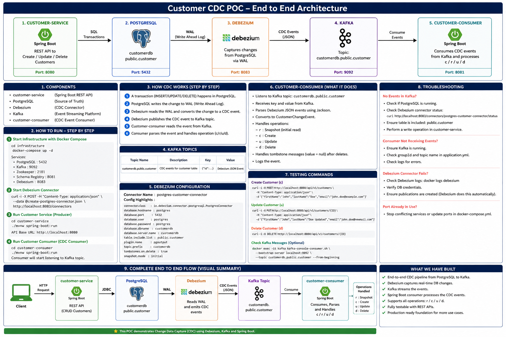

# Customer Data Platform --- CDC POC

## 1. Purpose

This repository demonstrates an end-to-end Change Data Capture (CDC)
pipeline:

**Spring Boot Customer Service → PostgreSQL → Debezium → Kafka → Spring
Boot CDC Consumer**

The POC deliberately stops at the consumer. It does **not** implement a
production read model, Schema Registry, DLQ platform, observability
stack, Kubernetes deployment, or other production-hardening phases.

### Completed scope

-   Phase 1 --- Foundation
-   Phase 2 --- PostgreSQL / logical replication
-   Phase 3 --- Customer Service
-   Phase 4 --- Kafka infrastructure
-   Phase 5 --- PostgreSQL → Debezium → Kafka CDC
-   Phase 6 --- Kafka CDC Consumer
-   Phase 16 --- Documentation
-   Phase 17 --- Final review / Git cleanup

Phases 7--15 are intentionally out of scope for this POC.

------------------------------------------------------------------------

## 2. Architecture



### End-to-end flow

``` text
Client
  |
  | HTTP
  v
customer-service (Spring Boot, :8080)
  |
  | SQL transaction
  v
PostgreSQL (customerdb, :5432)
  |
  | Write-Ahead Log (WAL)
  v
Debezium PostgreSQL Connector
running inside Kafka Connect (:8083)
  |
  | logical replication / CDC
  v
Kafka (:9092)
  |
  | topic: customerdb.public.customer
  v
customer-consumer (Spring Boot)
  |
  | parse + route CDC event
  v
log / application processing
```

### Important terminology

**Kafka** is the event streaming platform.

**Kafka Connect** is the runtime that runs connectors.

**Debezium** is the CDC connector/plugin running in Kafka Connect.

So, in this POC:

``` text
Kafka
  ^
  |
Kafka Connect
  ^
  |
Debezium PostgreSQL Connector
  ^
  |
PostgreSQL
```

Debezium is not a separate replacement for Kafka Connect; the Debezium
connector is deployed to and executed by Kafka Connect.

------------------------------------------------------------------------

## 3. Components

  ----------------------------------------------------------------------------
  Component             Role                                              Port
  --------------------- ------------------------- ----------------------------
  customer-service      REST API;                                         8080
                        creates/updates/deletes   
                        customers                 

  PostgreSQL            Source-of-truth customer                          5432
                        database                  

  Kafka                 Event streaming platform                          9092

  Kafka Connect +       Reads PostgreSQL logical                          8083
  Debezium              changes and publishes     
                        Kafka records             

  customer-consumer     Consumes and processes        No HTTP port in this POC
                        Debezium CDC events       
  ----------------------------------------------------------------------------

### PostgreSQL objects

Database:

``` text
customerdb
```

Table:

``` text
public.customer
```

CDC user:

``` text
cdc_user
```

Publication:

``` text
dbz_customer_publication
```

Replication slot:

``` text
debezium
```

------------------------------------------------------------------------

## 4. Prerequisites

Install and verify:

``` bash
docker --version
docker compose version
java -version
mvn -version
curl --version
git --version
```

The consumer project uses Java 21 and Spring Boot 3.5.x in this POC.

------------------------------------------------------------------------

# 5. How to Run --- Step by Step

## 5.1 Start infrastructure

From the repository root:

``` bash
docker compose up -d postgres kafka
```

If the complete Compose file is intended to start all infrastructure
services together, you can instead use:

``` bash
docker compose up -d
```

Check:

``` bash
docker compose ps
```

Expected core services:

``` text
customer-data-platform-postgres   Up / healthy
customer-data-platform-kafka      Up
```

### Network

Compose creates a project network. Do not assume its name is
`cdp-network`.

Check the actual network:

``` bash
docker network ls
```

In this POC the network was:

``` text
customer-data-platform-network
```

Inspect it with:

``` bash
docker network inspect customer-data-platform-network
```

Containers should show addresses on the same Docker network.

------------------------------------------------------------------------

# 6. PostgreSQL CDC Configuration

## 6.1 Verify the CDC role

``` bash
docker exec -it customer-data-platform-postgres \
  psql -U customer_app -d customerdb \
  -c "\du cdc_user"
```

The role must have:

``` text
Replication
```

## 6.2 Grant database CONNECT

If required:

``` bash
docker exec -it customer-data-platform-postgres \
  psql -U customer_app -d customerdb \
  -c "GRANT CONNECT ON DATABASE customerdb TO cdc_user;"
```

Verify:

``` bash
docker exec -it customer-data-platform-postgres \
  psql -U customer_app -d customerdb \
  -c "SELECT has_database_privilege('cdc_user', 'customerdb', 'CONNECT') AS can_connect;"
```

Expected:

``` text
can_connect
-----------
t
```

Verify direct login:

``` bash
docker exec -it customer-data-platform-postgres \
  psql -U cdc_user -d customerdb \
  -c "SELECT current_user, current_database();"
```

Expected:

``` text
current_user | current_database
-------------+----------------
cdc_user     | customerdb
```

## 6.3 Create the publication

The database owner creates the publication:

``` bash
docker exec -it customer-data-platform-postgres \
  psql -U customer_app -d customerdb \
  -c "CREATE PUBLICATION dbz_customer_publication FOR TABLE public.customer;"
```

Verify:

``` bash
docker exec -it customer-data-platform-postgres \
  psql -U customer_app -d customerdb \
  -c "SELECT pubname, pubowner::regrole, puballtables FROM pg_publication;"
```

Expected:

``` text
dbz_customer_publication | customer_app | f
```

Verify the table included in the publication:

``` bash
docker exec -it customer-data-platform-postgres \
  psql -U customer_app -d customerdb \
  -c "SELECT pubname, schemaname, tablename FROM pg_publication_tables WHERE pubname = 'dbz_customer_publication';"
```

Expected:

``` text
dbz_customer_publication | public | customer
```

### Why the publication is explicit

The CDC user is not the database owner. Instead of allowing Debezium to
create the publication, the database owner creates it and Debezium is
configured to use it.

This keeps the POC's CDC scope explicit:

``` text
dbz_customer_publication
        |
        +-- public.customer
```

------------------------------------------------------------------------

# 7. Debezium Configuration

Connector file:

``` text
infrastructure/docker/debezium/connectors/customer-connector.json
```

The important configuration is:

``` json
{
  "name": "customer-postgres-connector",
  "config": {
    "connector.class": "io.debezium.connector.postgresql.PostgresConnector",
    "database.hostname": "postgres",
    "database.port": "5432",
    "database.user": "cdc_user",
    "database.password": "<configured-password>",
    "database.dbname": "customerdb",
    "topic.prefix": "customerdb",
    "plugin.name": "pgoutput",
    "publication.name": "dbz_customer_publication",
    "publication.autocreate.mode": "disabled",
    "table.include.list": "public.customer"
  }
}
```

Do not commit real production credentials into Git. Use the password
already configured for the local POC environment.

### Important settings

  ----------------------------------------------------------------------------
  Setting                                  Purpose
  ---------------------------------------- -----------------------------------
  `PostgresConnector`                      Uses Debezium's PostgreSQL
                                           connector

  `database.hostname=postgres`             Docker DNS name for PostgreSQL

  `database.user=cdc_user`                 Dedicated CDC role

  `database.dbname=customerdb`             Source database

  `plugin.name=pgoutput`                   PostgreSQL logical decoding plugin

  `publication.name`                       Uses the manually created
                                           publication

  `publication.autocreate.mode=disabled`   Prevents Debezium from trying to
                                           create the publication

  `table.include.list=public.customer`     Captures only the customer table

  `topic.prefix=customerdb`                Prefix used to construct the Kafka
                                           topic name
  ----------------------------------------------------------------------------

------------------------------------------------------------------------

# 8. Register / Update the Debezium Connector

Kafka Connect REST API:

``` text
http://localhost:8083
```

## Initial registration

If the connector does not exist:

``` bash
curl -i -X POST \
  http://localhost:8083/connectors \
  -H "Content-Type: application/json" \
  --data @infrastructure/docker/debezium/connectors/customer-connector.json
```

## Updating an existing connector

Important: `PUT /connectors/{name}/config` expects the **config object
only**, not the outer `{ "name": ..., "config": ... }` wrapper.

Use:

``` bash
curl -i -X PUT \
  http://localhost:8083/connectors/customer-postgres-connector/config \
  -H "Content-Type: application/json" \
  --data "$(python3 -c 'import json; print(json.dumps(json.load(open("infrastructure/docker/debezium/connectors/customer-connector.json"))["config"]))')"
```

------------------------------------------------------------------------

# 9. Verify Debezium

Check connector status:

``` bash
curl http://localhost:8083/connectors/customer-postgres-connector/status
```

Healthy result:

``` text
connector.state = RUNNING
task.state      = RUNNING
```

The POC reached:

``` text
connector = RUNNING
task      = RUNNING
version   = 3.6.1.Final
```

## Verify replication slot

``` bash
docker exec -it customer-data-platform-postgres \
  psql -U customer_app -d customerdb \
  -c "SELECT slot_name, plugin, slot_type, active FROM pg_replication_slots;"
```

Expected:

``` text
slot_name | plugin  | slot_type | active
----------+---------+-----------+-------
debezium  | pgoutput | logical  | t
```

The important values are:

``` text
debezium
pgoutput
logical
t
```

------------------------------------------------------------------------

# 10. Kafka Topic

Debezium creates the topic:

``` text
customerdb.public.customer
```

Describe it:

``` bash
docker exec -it customer-data-platform-kafka \
  /opt/kafka/bin/kafka-topics.sh \
  --describe \
  --topic customerdb.public.customer \
  --bootstrap-server localhost:9092
```

For the POC, the topic has one partition and one replica.

## Consume records manually

To inspect everything from the beginning:

``` bash
docker exec -it customer-data-platform-kafka \
  /opt/kafka/bin/kafka-console-consumer.sh \
  --bootstrap-server localhost:9092 \
  --topic customerdb.public.customer \
  --from-beginning \
  --property print.key=true \
  --property print.value=true \
  --property key.separator=" | "
```

To listen only for new records:

``` bash
docker exec -it customer-data-platform-kafka \
  /opt/kafka/bin/kafka-console-consumer.sh \
  --bootstrap-server localhost:9092 \
  --topic customerdb.public.customer \
  --property print.key=true \
  --property print.value=true \
  --property key.separator=" | "
```

------------------------------------------------------------------------

# 11. How CDC Works

The complete sequence is:

``` text
1. customer-service executes INSERT/UPDATE/DELETE
              |
              v
2. PostgreSQL changes public.customer
              |
              v
3. PostgreSQL writes the change to WAL
              |
              v
4. Debezium reads PostgreSQL logical changes
              |
              v
5. Debezium converts the change into a CDC event
              |
              v
6. Debezium publishes the event to Kafka
              |
              v
7. customer-consumer receives the Kafka record
              |
              v
8. Jackson parses the Debezium event
              |
              v
9. CustomerChangeHandler routes the operation
```

### PostgreSQL CDC objects

**WAL**

The Write-Ahead Log records database changes.

**Publication**

``` text
dbz_customer_publication
```

defines which table is available for logical replication.

**Replication slot**

``` text
debezium
```

maintains the logical replication position for Debezium.

**Debezium**

Reads the PostgreSQL change stream and turns it into Kafka events.

------------------------------------------------------------------------

# 12. Debezium Event Anatomy


A Kafka record has two important pieces:

``` text
Kafka Record
|
+-- KEY
|     {"id": 3}
|
+-- VALUE
      {
        "payload": {
          "before": ...,
          "after": ...,
          "source": ...,
          "op": "u"
        }
      }
```

## Key

The key contains the customer's primary key:

``` json
{
  "id": 3
}
```

The key represents **customer identity**.

## `before`

State before the change.

-   INSERT: `null`
-   UPDATE: old row
-   DELETE: deleted row

## `after`

State after the change.

-   INSERT: new row
-   UPDATE: new row
-   DELETE: `null`

## `op`

  Value   Meaning
  ------- ---------------------
  `r`     Snapshot/read event
  `c`     Create / INSERT
  `u`     UPDATE
  `d`     DELETE

## `source`

Contains database metadata such as:

``` text
connector
database/name
schema
table
transaction id
LSN
snapshot information
```

The PostgreSQL LSN identifies a position in the WAL stream.

------------------------------------------------------------------------

# 13. Snapshot vs Live CDC

When Debezium starts, it can first snapshot existing rows.

Those events have:

``` text
op = r
```

For example:

``` text
existing customer
      |
      v
Debezium snapshot
      |
      v
Kafka
      |
      v
op = r
```

After the snapshot, normal database changes produce:

``` text
INSERT → op=c
UPDATE → op=u
DELETE → op=d
```

So a consumer must understand that `r` is a snapshot/read event, not a
normal live INSERT.

------------------------------------------------------------------------

# 14. Tombstone Records

After a DELETE, Kafka may also contain a tombstone:

``` text
key   = {"id": 6}
value = null
```

The POC consumer explicitly handles this:

``` java
if (value == null) {
    log.info("Received tombstone for customer key: {}", key);
    return;
}
```

This prevents Spring Kafka from rejecting the null payload.

The distinction is:

``` text
DELETE CDC event
    |
    +-- value contains Debezium event
    |      op = d
    |
    +-- tombstone
           value = null
```

------------------------------------------------------------------------

# 15. Customer Consumer

Project:

``` text
customer-consumer/
```

The consumer is a separate Spring Boot application.

It does **not** connect to PostgreSQL.

Its dependency is:

``` text
Kafka
  |
  v
customer-consumer
```

## Kafka configuration

`src/main/resources/application.yml`:

``` yaml
spring:
  application:
    name: customer-consumer

  kafka:
    bootstrap-servers: localhost:9092
    consumer:
      group-id: customer-consumer-group
      auto-offset-reset: earliest
      key-deserializer: org.apache.kafka.common.serialization.StringDeserializer
      value-deserializer: org.apache.kafka.common.serialization.StringDeserializer
```

The consumer group is:

``` text
customer-consumer-group
```

## Listener

The consumer receives:

``` java
ConsumerRecord<String, String>
```

so it can access:

``` text
record.key()
record.value()
record.topic()
record.partition()
record.offset()
```

## Processing flow

``` text
Kafka record
     |
     v
CustomerChangeConsumer
     |
     +-- null value?
     |      |
     |      +-- tombstone
     |
     v
Jackson ObjectMapper
     |
     v
CustomerChangeEvent
     |
     v
CustomerChangeHandler
     |
     +-- r → snapshot
     +-- c → create
     +-- u → update
     +-- d → delete
```

The POC uses SLF4J logging rather than `System.out`.

------------------------------------------------------------------------

# 16. Consumer Data Models

The simplified event model is:

``` java
public record CustomerChangeEvent(
        String operation,
        CustomerData before,
        CustomerData after
) {
}
```

Customer data:

``` java
public record CustomerData(
        Long id,
        String first_name,
        String last_name,
        String email,
        String created_at,
        String updated_at
) {
}
```

The consumer intentionally ignores Debezium fields that are not needed
for this POC.

------------------------------------------------------------------------

# 17. Testing --- End to End

The strongest test is to create a customer through the real API and
observe it at every layer.

## 17.1 Start the consumer

From `customer-consumer`:

``` bash
./mvnw spring-boot:run
```

## 17.2 Create customer

From another terminal:

``` bash
curl -i -X POST http://localhost:8080/api/v1/customers \
  -H "Content-Type: application/json" \
  -d '{
    "firstName": "CDC",
    "lastName": "Demo",
    "email": "cdc.demo@example.com"
  }'
```

Expected:

``` text
customer-service → PostgreSQL
                 → WAL
                 → Debezium
                 → Kafka
                 → customer-consumer
```

Consumer should report:

``` text
Customer CREATED
```

with:

``` text
operation = c
```

## 17.3 Update customer

Replace `<ID>` with the ID returned by the POST:

``` bash
curl -i -X PUT http://localhost:8080/api/v1/customers/<ID> \
  -H "Content-Type: application/json" \
  -d '{
    "firstName": "CDC",
    "lastName": "Updated",
    "email": "cdc.updated@example.com"
  }'
```

Consumer should report:

``` text
Customer UPDATED
```

with:

``` text
operation = u
before = old state
after  = new state
```

## 17.4 Delete customer

``` bash
curl -i -X DELETE \
  http://localhost:8080/api/v1/customers/<ID>
```

Expected:

``` text
HTTP 204
```

Consumer should report:

``` text
Customer DELETED
```

and may subsequently report:

``` text
Received tombstone for customer key: ...
```

## 17.5 Verify PostgreSQL

``` bash
docker exec -it customer-data-platform-postgres \
  psql -U customer_app -d customerdb \
  -c "SELECT id, first_name, last_name, email FROM customer ORDER BY id;"
```

------------------------------------------------------------------------

# 18. Consumer Unit Tests

The CDC routing logic is tested without requiring Kafka.

Tests cover:

``` text
r → snapshot
c → create
u → update
d → delete
unknown operation → rejected
```

Run:

``` bash
./mvnw clean test
```

Expected:

``` text
BUILD SUCCESS
```

------------------------------------------------------------------------

# 19. Troubleshooting

## 19.1 Connector says `RUNNING` but task says `FAILED`

Check:

``` bash
curl http://localhost:8083/connectors/customer-postgres-connector/status
```

Always inspect the `tasks` section.

Healthy:

``` text
connector: RUNNING
task:      RUNNING
```

A connector can be `RUNNING` while its task is `FAILED`.

------------------------------------------------------------------------

## 19.2 `permission denied for database customerdb`

Verify:

``` bash
docker exec -it customer-data-platform-postgres \
  psql -U customer_app -d customerdb \
  -c "SELECT has_database_privilege('cdc_user', 'customerdb', 'CONNECT');"
```

Grant if necessary:

``` bash
docker exec -it customer-data-platform-postgres \
  psql -U customer_app -d customerdb \
  -c "GRANT CONNECT ON DATABASE customerdb TO cdc_user;"
```

Then make sure the connector is configured to use the existing
publication:

``` text
publication.name=dbz_customer_publication
publication.autocreate.mode=disabled
```

Update the connector configuration and check status again.

------------------------------------------------------------------------

## 19.3 `PUT /config` returns deserialization error

If you see:

``` text
Cannot deserialize value of type java.lang.String from Object value
```

you probably sent:

``` json
{
  "name": "...",
  "config": {
    ...
  }
}
```

to:

``` text
PUT /connectors/<name>/config
```

The PUT endpoint expects only:

``` json
{
  "connector.class": "...",
  "database.hostname": "...",
  ...
}
```

Use the Python extraction command shown in Section 8.

------------------------------------------------------------------------

## 19.4 Consumer says `Payload value must not be empty`

This usually means Kafka delivered a tombstone:

``` text
key   = customer key
value = null
```

The listener must accept null values and handle them explicitly:

``` java
if (value == null) {
    log.info("Received tombstone...");
    return;
}
```

Do not treat a tombstone as a Debezium JSON event.

------------------------------------------------------------------------

## 19.5 `ObjectMapper` bean not found

If startup reports:

``` text
required a bean of type
com.fasterxml.jackson.databind.ObjectMapper
that could not be found
```

make sure the consumer has Spring Boot's JSON support:

``` xml
<dependency>
    <groupId>org.springframework.boot</groupId>
    <artifactId>spring-boot-starter-json</artifactId>
</dependency>
```

Then:

``` bash
./mvnw clean test
```

------------------------------------------------------------------------

## 19.6 Kafka consumer receives nothing

Check:

``` bash
docker compose ps
```

Then verify the topic:

``` bash
docker exec -it customer-data-platform-kafka \
  /opt/kafka/bin/kafka-topics.sh \
  --describe \
  --topic customerdb.public.customer \
  --bootstrap-server localhost:9092
```

Check Debezium:

``` bash
curl http://localhost:8083/connectors/customer-postgres-connector/status
```

Then perform a fresh INSERT through customer-service.

------------------------------------------------------------------------

## 19.7 Docker network not found

Do not assume the network is named:

``` text
cdp-network
```

Check:

``` bash
docker network ls
```

Then inspect the actual network shown by Compose.

------------------------------------------------------------------------

## 19.8 Consumer connects from Mac but not from Docker

When running Java directly on the Mac:

``` yaml
bootstrap-servers: localhost:9092
```

When the consumer itself runs inside Docker, use the Kafka service's
Docker hostname/listener configured by the Compose file instead.

The networking context matters:

``` text
Mac → localhost:9092

Docker container → Kafka Docker hostname/listener
```

------------------------------------------------------------------------

# 20. Useful Verification Commands

### Docker

``` bash
docker compose ps
docker network ls
docker network inspect customer-data-platform-network
```

### PostgreSQL

``` bash
docker exec -it customer-data-platform-postgres \
  psql -U customer_app -d customerdb
```

### Publication

``` bash
docker exec -it customer-data-platform-postgres \
  psql -U customer_app -d customerdb \
  -c "SELECT pubname, pubowner::regrole, puballtables FROM pg_publication;"
```

### Publication tables

``` bash
docker exec -it customer-data-platform-postgres \
  psql -U customer_app -d customerdb \
  -c "SELECT pubname, schemaname, tablename FROM pg_publication_tables;"
```

### Replication slots

``` bash
docker exec -it customer-data-platform-postgres \
  psql -U customer_app -d customerdb \
  -c "SELECT slot_name, plugin, slot_type, active FROM pg_replication_slots;"
```

### Debezium

``` bash
curl http://localhost:8083/connectors/customer-postgres-connector/status
```

### Kafka topic

``` bash
docker exec -it customer-data-platform-kafka \
  /opt/kafka/bin/kafka-topics.sh \
  --describe \
  --topic customerdb.public.customer \
  --bootstrap-server localhost:9092
```

### Kafka consumer

``` bash
docker exec -it customer-data-platform-kafka \
  /opt/kafka/bin/kafka-console-consumer.sh \
  --bootstrap-server localhost:9092 \
  --topic customerdb.public.customer \
  --from-beginning \
  --property print.key=true \
  --property print.value=true
```

------------------------------------------------------------------------

# 21. Final POC Validation Checklist

Before calling the POC complete:

-   [x] PostgreSQL running
-   [x] Kafka running
-   [x] Kafka Connect running
-   [x] Debezium PostgreSQL connector registered
-   [x] `cdc_user` has replication capability
-   [x] `cdc_user` can connect to `customerdb`
-   [x] `dbz_customer_publication` exists
-   [x] publication contains `public.customer`
-   [x] `debezium` replication slot exists
-   [x] replication slot is active
-   [x] `customerdb.public.customer` Kafka topic exists
-   [x] Initial snapshot events observed
-   [x] INSERT event observed (`op=c`)
-   [x] UPDATE event observed (`op=u`)
-   [x] DELETE event observed (`op=d`)
-   [x] Tombstone handled
-   [x] Kafka key contains customer primary key
-   [x] Spring Boot consumer receives records
-   [x] Jackson parses Debezium events
-   [x] Consumer routes `r/c/u/d`
-   [x] Consumer unit tests pass
-   [x] Phase 5 committed and pushed
-   [x] Phase 6 committed and pushed

------------------------------------------------------------------------

# 22. Git Checkpoints

The project intentionally uses meaningful checkpoints.

### Phase 5

``` bash
git commit -m "feat: add Debezium CDC pipeline"
git push origin main
```

### Phase 6

``` bash
git commit -m "feat: add Debezium CDC consumer"
git push origin main
```

Always verify before committing:

``` bash
git status
git diff --stat
git diff
```

------------------------------------------------------------------------

# 23. What This POC Demonstrates

The final system proves:

``` text
Customer API
     |
     v
PostgreSQL transaction
     |
     v
PostgreSQL WAL
     |
     v
Debezium logical CDC
     |
     v
Kafka topic
     |
     v
Spring Boot consumer
     |
     v
Application-level event handling
```

The most important lesson is that the customer service does not need to
call the consumer directly.

The source application changes the database, Debezium captures the
database change, Kafka transports the event, and independent consumers
react to it.

This gives us a clean event-driven boundary without coupling the
customer service to downstream systems.

------------------------------------------------------------------------

# 24. Scope Deliberately Not Implemented

For this POC, the following are intentionally excluded:

-   Customer read model database
-   Search service
-   Redis/cache
-   Schema Registry
-   Dead Letter Queue infrastructure
-   Advanced retry strategy
-   Exactly-once processing
-   Kubernetes
-   Production authentication/authorization
-   TLS/mTLS
-   Full observability stack
-   Distributed tracing
-   Production deployment
-   Advanced schema evolution
-   Multi-region architecture

These can be added later if the POC needs to evolve into a production
design.

------------------------------------------------------------------------

# 25. Quick Start Summary

For someone returning to this project later:

``` text
1. Start Docker infrastructure
2. Verify PostgreSQL + Kafka
3. Verify CDC role
4. Verify publication
5. Verify Debezium connector
6. Verify replication slot
7. Verify Kafka topic
8. Start customer-service
9. Start customer-consumer
10. POST a customer
11. Observe op=c
12. PUT the customer
13. Observe op=u
14. DELETE the customer
15. Observe op=d + possible tombstone
16. Run tests
17. Check Git status
```

The core pipeline is:

``` text
PostgreSQL → Debezium → Kafka → customer-consumer
```

and the POC is complete when that pipeline works end to end.
